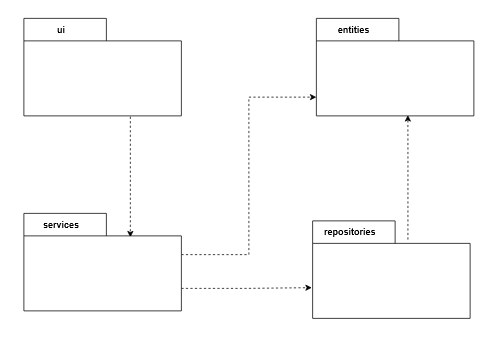
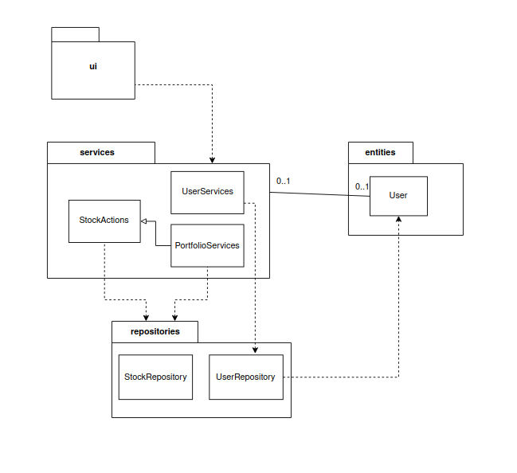
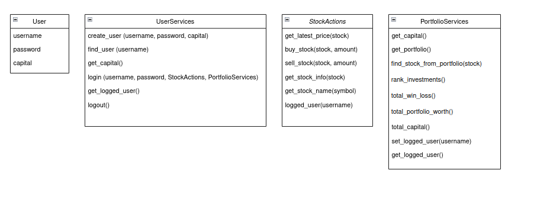
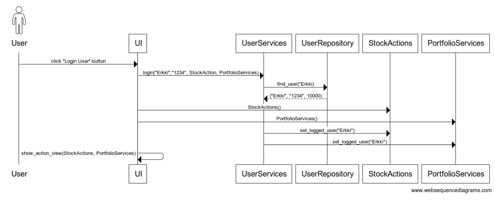
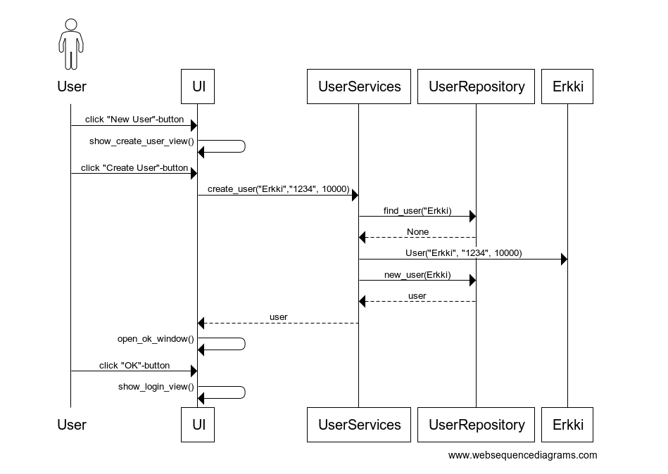
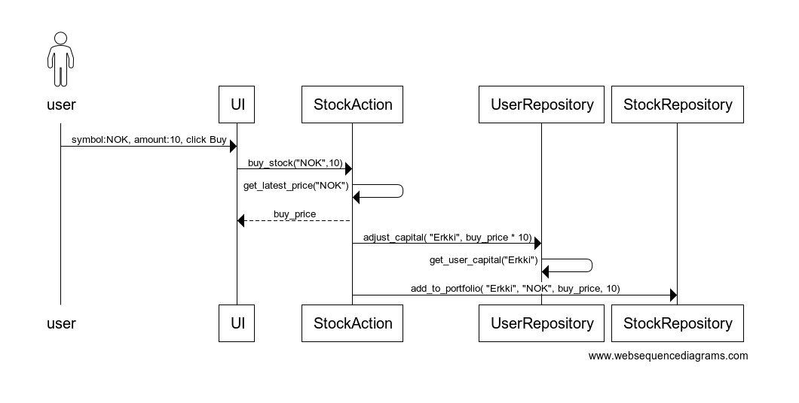
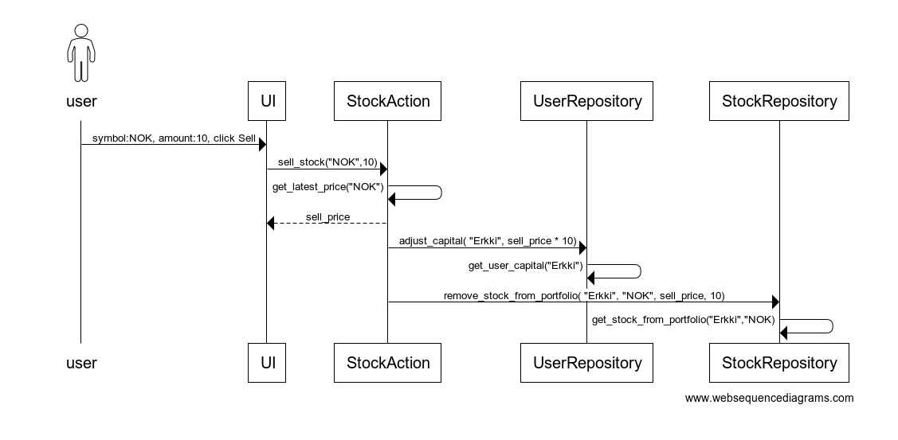

# Arkkitehtuuri

## Ohjelman rakenne

Ohjelman keskeinen rakenne muodostuu _ui-_, _services-_, _entities-_ ja _repositories_ -pakkauksista, joiden keskinäinen riippuvuus esittäytyy seuraavalla tavalla:

Pakkaus _ui_ sisältää käyttöliittymä vastaavat luokat, _services_ sisältää sovelluslogiikasta ja portfolion esittämisestä vastaavat luokat, sekä _entities_ sisältää käyttäjäjään liittyvä tiedon. _Repository_ -pakkauksen luokat taas vastaavat tietojen pysyväistallennuksesta tietokantaan.

## Käyttöliittymä

Käyttöliittymä sisältää neljä erillaista näkymää:

- Kirjautuminen
- Uuden käyttäjän luominen
- Osakkeiden osto ja myynti, sekä yritystietojen ja hintojen hakeminen
- Portfolion tarkastelu

UI-luokka vastaa näkymien näyttämisestä ja jokaiselle näkymälle on oma luokkansa. Luokat ovat _LoginView_, _CreateUserView_, _ActionView_ ja _PortfolioView_, joista näkyy aina yksi kerrallaan. Näkymien luokat kutsuvat ainoastaan _services_ -luokkien metodeita, joten käyttöliittymä on tällä tavoin kokonaan eriytetty sovelluslogiikasta. 

## Sovelluslogiikka

Luokkien välistä suhdetta kuvaava pakkaus/luokkakaavio:

StockActions ja PortfolioServices-luokat pääsevät käsiksi tietokantaan pakkauksen repositories luokkien kautta ja UserServices luokka UserRepository-luokan kautta.   

**Luokat**

Sovelluslogiikan kannalta oleellisimmat luokat ovat User, UserServices, StockActions ja PortfolioServices.

## Tietojen pysyväistallennus

Sovellus tallentaa käyttäjien ja osakkeiden tiedot SQLite- tietokantaan tauluihin nimeltä _Stocks_ ja _Users_, jotka alustetaan initialize_database.py-tiedostossa.

**Tiedostot**

Konfiguraatiotiedostossa .env on määritelty tietokantatiedoston nimi ja testejä suoritettaessa käytetään erikseen .env.test-konfiguraatiotiedostossa määriteltyä tietokantatiedoston nimeä. Tiedostojen polku on määritelty config.py-tiedostossa.

## Sovelluksen päätoiminnallisuudet

Päätoiminnallisuuksien sekvenssikaaviot kuvaavat, kuinka kontrolli etenee sovelluksessa toiminnon suoritusaikana.

### Sovellukseen kirjautuminen

Kun käyttäjä syöttää käyttäjätunnuksen sekä salasanan ja painaa Login-näppäintä, kontrolli etenee seuraavanlaisesti:

Login-painikkeeseen reagoiva LoginView-luokan tapahtumankäsittelijä login_handler kutsuu UserServices luokan login-metodia antaen parametriksi käyttäjätunnuksen ja salasanan, sekä sisäänkirjattavat StockActions- sekä PortfolioServices-luokat. UserServices kutsuu UserRepository-luokan find_user-metodia tarkistaakseen löytyykö käyttäjätunnus. Jos käyttäjätunnus löytyy UserServices-luokan metodi-Login tarkistaa täsmääkö salasanat. Jos salasanat täsmäävät sisäänkirjautuminen onnistuu, jolloin Login-metodi kirjaa käyttäjän UserServices-, StockActions- ja PortfolioServices-luokkiin, sekä vaihtaa näkymäksi ActionView-näkymän.

### Uuden käyttäjän luominen

Kun käyttäjä haluaa luoda uuden käyttäjätunnuksen etenee sovelluksen kontrolli seuraavalla tavalla:

Kun käyttäjä painaa "New User"-painiketta käyttöliittymä vaihtaa näkymäksi CreateUserView-näkymän. "Create User" - painalluksen seurauksena tapahtumankäsittelijä create_user_handler kutsuu UserServices luokan create_user-metodia joka saa parametrina syötetyt käyttäjätunnuksen, salasanan ja pääoman. UserServices kutsuu UserRepositroy-luokan find_user-metodia tarkistaakseen löytyykö käyttäjätunnus. Mikäli käyttäjätunnus ei ole käytössä, tunnuksen luonti onnistuu, jolloin UserServices luo User-olion ja tallentaa sen kutsumalla UserRepository-luokan new_user-metodia. Onnistuneen tunnuksen luonnin jälkeen open_ok_window-metodi avaa uuden ikkunan joka näyttää vahvistuksen onnistuneesta tunnuksen luonnista. "OK"-painikkeen klikkaus sulkee ikkunan siirtää sovelluksen takaisin LoginView-näkymään.

### Osakkeen ostaminen

Osaketta ostettaessa kontrolli kulkee sovelluksessa seuraavanlaisesti:

Kun käyttäjä painaa Buy-painiketta tapahtumankäsittelijä handle_buy kutsuu StockActions-luokan buy_stock-metodia joka saa parametrina syötetyt osakkeen symbolin ja osakkeiden määrän. buy_stock-metodi kutsuu saman luokan get_latest_price-metodia joka saa parametrinaan käyttäjän syöttämän osakkeen symbolin. Mikäli symboli löytyy jatkuu metodin suoritus kutsumalla UserRepository-luokan adjust_capital-metodia, joka saa parametrinaan haetun hinnan kerrottuna käyttäjän syöttämällä osakkeiden määrällä ja negatiiviseksi muutettuna. UserRepository hakee käyttäjän pääoman tietokannasta ja päivittää sen mikäli pääomaa on riittävästi. Jos pääomaa oli riittävästi jatkuu suoritus kutsumalla StockRepository-luokan add_to_portfolio-metodia, joka saa parametrinaan käyttäjätunnuksen, osakkeen symbolin, ostohinnan ja osakkeiden määrän tallettaakseen ne tietokantaan. 

### Osakkeen myyminen

Osaketta myytäessa kontrolli kulkee sovelluksessa seuraavanlaisesti:

