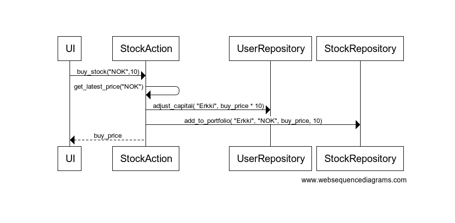

# Arkkitehtuuri

## Ohjelman rakenne

Ohjelman keskeinen rakenne muodostuu _ui-_, _services-_, _entities-_ ja _repositories_ -pakkauksista, joiden keskinäinen riippuvuus esittäytyy seuraavalla tavalla:

Pakkaus _ui_ sisältää käyttöliittymä vastaavat luokat, _services_ sisältää sovelluslogiikasta ja portfolion esittämisestä vastaavat luokat, sekä _entities_ sisältää käyttäjäjään liittyvä tiedon. _Repository_ -pakkauksen luokat taas vastaavat tietojen pysyväistallennuksesta tietokantaan.

## Käyttöliittymä

Käyttöliittymä sisältää neljä erillaista näkymää:

- Kirjautuminen
- Uuden käyttäjän luominen
- Osakkeiden osto ja myynti, sekä yritystietojen ja hintojen hakeminen
- Portfolion tarkastelu

UI-luokka vastaa näkymien näyttämisestä ja jokaiselle näkymälle on oma luokkansa. Luokat ovat _login_view_, _create_user_view_, _action_view_ ja _portfolio_view_. Näkymien luokat kutsuvat ainoastaan _services_ -luokkien metodeita, joten käyttöliittymä on tällä tavoin kokonaan eriytetty sovelluslogiikasta. 

## Sovelluslogiikka

**Luokat**

Sovelluslogiikan kannalta oleellisimmat luokat ovat User, UserServices, StockActions ja PortfolioServices.

## Osakkeen ostaminen

Kun käyttäjä ostaa osaketta sovelluksen kontrolli kulkee seuraavanlaisesti:

