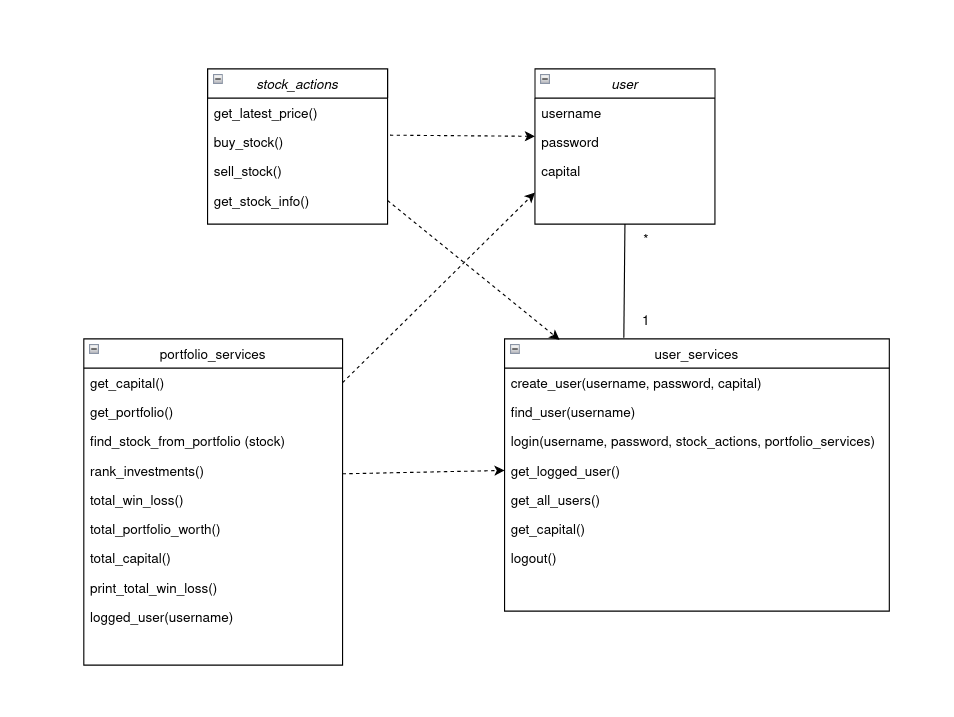

# Arkkitehtuuri

## Rakenne ja sovelluslogiikka

Pakkausrakenne: 

**Luokkakaavio**

Sovelluksen loogisen toiminnan kannalta oleellisimmat luokat ovat User, UserServices, StockActions ja PortfolioServices.

**Osakkeen ostaminen**

Kun käyttäjä ostaa osaketta sovelluksen kontrolli kulkee seuraavanlaisesti:

