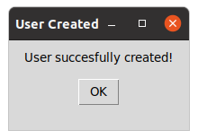
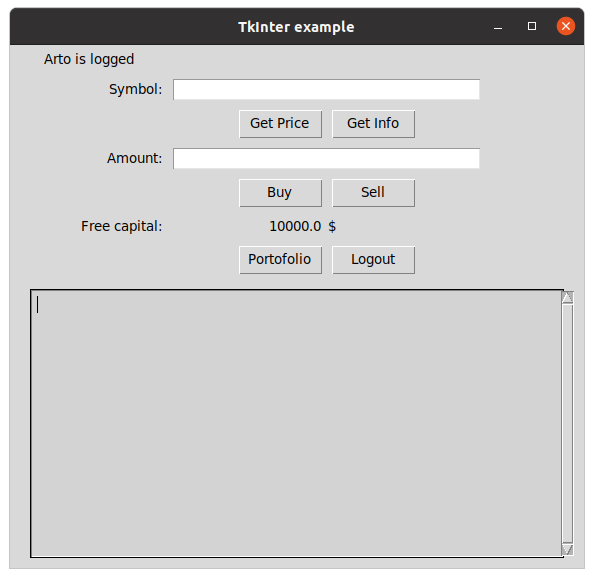
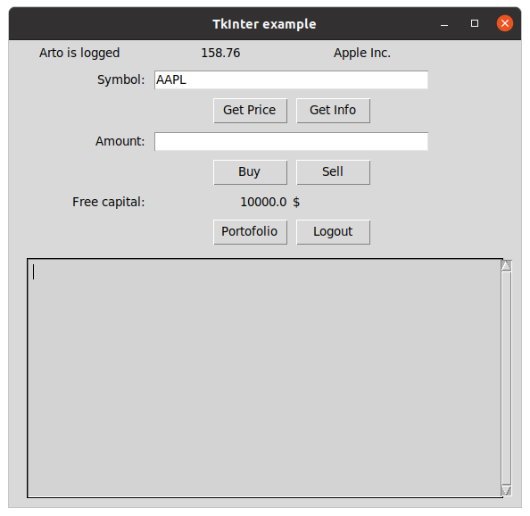
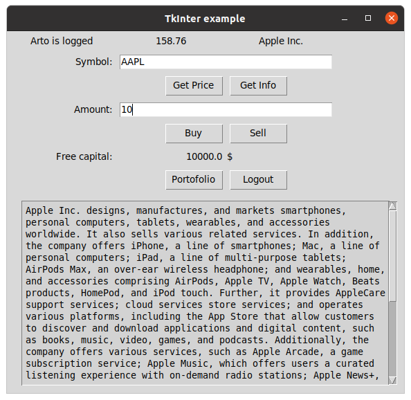

# Käyttöohje

## Ohjelman käynnistäminen

## Kirjautuminen
Sovelluksen ensimmäinen näykäm on kirjautumisnäkymä. Kirjaudu sisään antamalla käyttäjä tunnus ja salasana ja paina "Login".

## Tunnuksen luominen
Uuden käyttäjän pääset luomaan painamalla alkunäkymästä "New user". Syötä käyttäjänimi, salasana, sekä valitsemasi pääoman määrä. Käyttäjän luonti tapahtuu "Create"-näppäimestä. Jos haluat peruuttaa tunnuksen luonnin ja siirtyä takaisin kirjautumisnäkymään onnistuu se näppäimestä "Back". 

  

  

  

  

  

  

