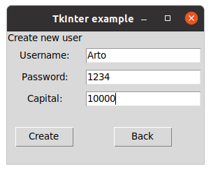
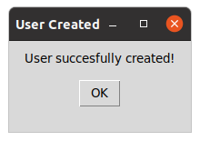
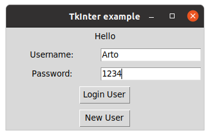
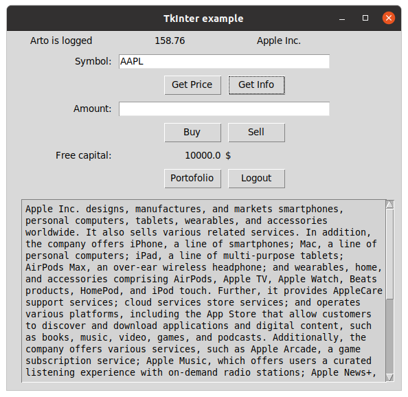
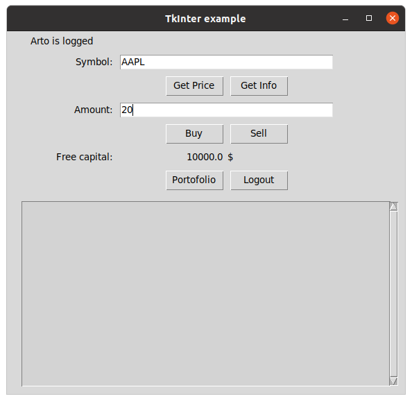
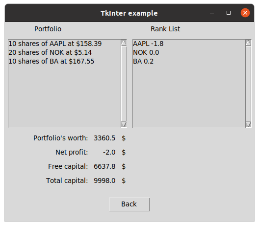

# Käyttöohje

## Ohjelman käynnistäminen

## Tunnuksen luominen
Uuden tunnukset pääset luomaan painamalla alkunäkymästä "New user". Syötä käyttäjänimi, salasana, sekä valitsemasi pääoman määrä. Käyttäjän luonti tapahtuu "Create"-näppäimestä. Jos haluat peruuttaa tunnuksen luonnin ja siirtyä takaisin kirjautumisnäkymään onnistuu se näppäimestä "Back". 

Onnistuneesta tunnuksen luomisesta ilmoittaa uusi avautuu ikkuna. "Ok"- näppäin ohjaa takaisin kirjautumisnäkymään.

## Kirjautuminen
Sovelluksen ensimmäinen näykäm on kirjautumisnäkymä. Kirjaudu sisään antamalla käyttäjä tunnus ja salasana ja paina "Login".

## Hinnan ja yritystietojen tietojen hakeminen

Osakkeen hinnan saat syöttämällä osakkeen symbolin "Symbol:"-kenttään ja painamalla "Get Price". Osakkeen hinta ja -nimi tulostuvat ikkunan yläriville. Yrityken tiedot saat esiin "Get Info"- näppäimestä. Tiedot tulostuvat ikkunan alaosassa olevaan tekstikenttään. 

  
## Osakkeen ostaminen ja myyminen

Osakkeen ostaminen ja myyminen sovelluksella on helppoa. Syötä osakkeen tunnus "Symbol"-kenttään ja haluamasi määrä "Amount"- kenttään ja paina "Buy" ostaaksesi ja "Sell"-myydäksesi osaketta. Sovellus hakee aina viimeisimmän hinnan osakkeelle toimeksiannon yhteydessä.

## Portfolion tarkastelu

Portfoliossa olevia osakkeita pääsee tarkastelemaan "Portfolio"- näppäimestä. 
  

