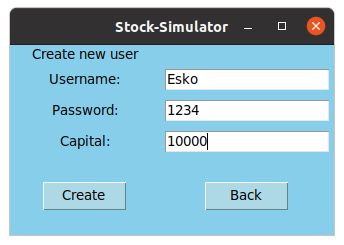
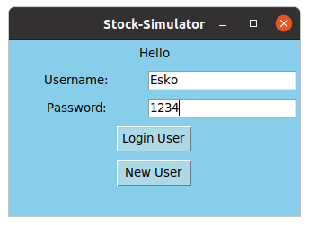
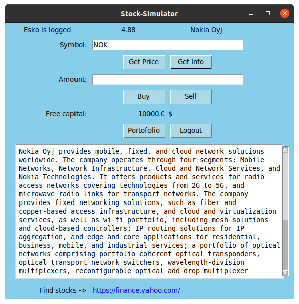
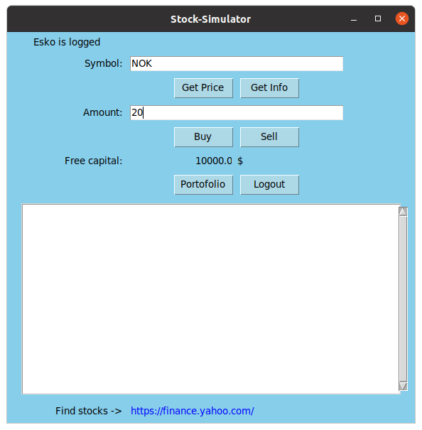
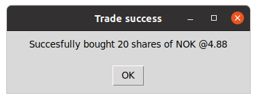

# Käyttöohje

## Ohjelman käynnistäminen

## Tunnuksen luominen
Uuden tunnukset pääset luomaan painamalla alkunäkymästä "New user". Syötä käyttäjänimi, salasana, sekä valitsemasi pääoman määrä. Käyttäjän luonti tapahtuu "Create"-näppäimestä. Jos haluat peruuttaa tunnuksen luonnin ja siirtyä takaisin kirjautumisnäkymään onnistuu se näppäimestä "Back". 

Onnistuneesta tunnuksen luomisesta ilmoittaa uusi avautuu ikkuna.

"Ok"- näppäin siirtää takaisin sovelluksen kirjautumisnäkymään.

## Kirjautuminen

Kirjaudu sisään antamalla käyttäjätunnus ja salasana ja paina "Login".

## Osakkeen hinnan ja yritystietojen hakeminen

Osakkeen hinnan saat syöttämällä osakkeen symbolin "Symbol:"-kenttään ja painamalla "Get Price". Osakkeen hinta ja -nimi tulostuvat ikkunan yläriville. Yrityken tiedot saat esiin "Get Info"- näppäimestä. Tiedot tulostuvat ikkunan alaosassa olevaan tekstikenttään. 

Portfoliossa olevia osakkeita pääsee tarkastelemaan "Portfolio"- näppäimestä. Käyttäjän voi kirjata ulos sovelluksesta "Logout"-näppäimellä.
  
## Osakkeen ostaminen ja myyminen

Osakkeen ostaminen ja myyminen sovelluksella on helppoa. Syötä osakkeen tunnus "Symbol"-kenttään ja haluamasi määrä "Amount"- kenttään ja paina "Buy" ostaaksesi ja "Sell"-myydäksesi osaketta. Sovellus hakee aina viimeisimmän hinnan osakkeelle toimeksiannon yhteydessä. 

Onnistuneesta myynti- ja ostotapahtumasta avautuu siitä ilmoittava ikkuna.

"OK"-näppäin sulkee avautuneen ikkunan.

## Portfolion tarkastelu

Portfolio näkymässä, vasemmanpuoleisessa "Portfolio"- listassa näkyvät osakkeiden määrät ja niiden keskimääräiset hankinta hinnat. Oikean puoleisessa "Rank List"- listassa osakkeet ovat lajiteltuna tuoton mukaiseen järjestykseen, ylimpänä eniten tuottanut ja alimpana eniten tappiolla oleva. Näkymässä näkyvät myös portfolion arvo, omistusten nettotuotto, vapaan pääoman määrä, kokonaispääoma, aloituspääoma, sekä nettotulos. Takaisin päänäkymään pääset "Back"- näppäimestä.

  

